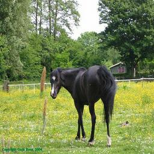
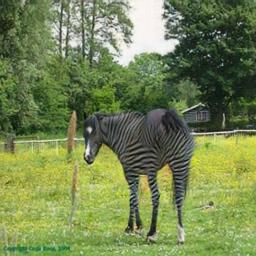
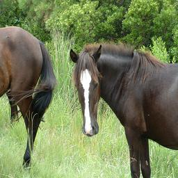
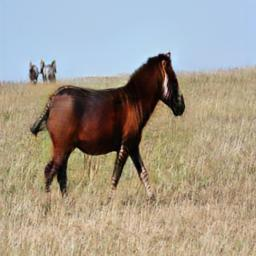
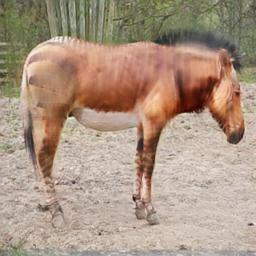

# CycleGAN

Tensorflow 2.0 implementation of CycleGAN

## Datasets

### horse2zebra

Raw: https://people.eecs.berkeley.edu/~taesung_park/CycleGAN/datasets/horse2zebra.zip

Also added 54 horses images to `horse2zebra/trainA`: https://drive.google.com/file/d/1n81lzXAFSP71yZKghTiOJ_dHRoJfkNE6/view?usp=sharing

Use `tfrecords.py` to generate TFRecords before training
```bash
python tfrecords.py --dataset=horse2zebra
```

### CelebA

labels:
https://drive.google.com/file/d/1v7UkkwpAe-vDqEqArGFM1MBs5FLEa3re/view?usp=sharing

images:
https://drive.google.com/open?id=1P0mYEE5xVAHL9laE2kbRDZEU9x9VAEed

to download through wget, please refer to this:
https://gist.github.com/vladalive/535cc2aff8a9527f1d9443b036320672

Extract it to a directory called `img_align_celeba`, then
```bash
mkdir -p ./datasets/celeba/trainA/
mkdir -p ./datasets/celeba/trainB/
python celeba.py
mkdir -p ./tfrecords/celeba/
python tfrecords.py --dataset=celeba
```
## Training

### horse2zebra

```bash
make train_horse
```

log: https://drive.google.com/file/d/19w2EyoCbvKIgoXdEkKYWAxMs8Sc1erCU/view?usp=sharing

tensorboard: https://drive.google.com/file/d/13aybrJh0MCENnuhL3VjoBd2yBhtONZV5/view?usp=sharing


## Examples

### Horse to Zebra








 ### Zebra to Horse







## Reference

https://github.com/junyanz/pytorch-CycleGAN-and-pix2pix
https://github.com/hardikbansal/CycleGAN
https://github.com/LynnHo/CycleGAN-Tensorflow-2

## TensorBoard

ssh -i {credential_file} -L 6006:127.0.0.1:6006 {remote_location} 